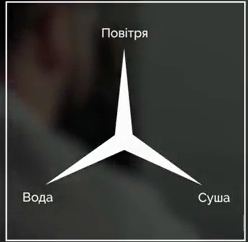

#Територія

Перші форми організації суспільства будувалися на основі кровного споріднення. Зі збільшенням населення та, часто, з переходом від кочівного способу життя до осілого виникає нова форма організації суспільства &ndash; держава із визначеною територію, в межах якої поширювалася її влада. Така форма була досконалішою. Показово, що тривалість життя кочівних держав (&laquo;держав без територій&raquo;), наприклад Монгольської імперії, була незначною, а останні такі держави зникли ще у ХVIII ст.

<iframe align="center" width="560" height="315" src="https://www.youtube.com/embed/inZS7LU22xI" frameborder="0" allowfullscreen></iframe>

 

Цікаво!

Тривалий час точаться дискусії щодо виділення території для створення курдським народом держави Курдистан. Але зважаючи на те, що сьогодні курди проживають на території чотирьох незалежних держав (Туреччини, Сирії, Ірану та Іраку), які не бажають віддавати частину своєї території іншій державі, це доволі малоймовірно.

В класичному розумінні до території держави відносять:

<ul>
<li>суходіл;</li>
<li>водний простір;</li>
<li>повітряний простір;</li>
</ul> 

