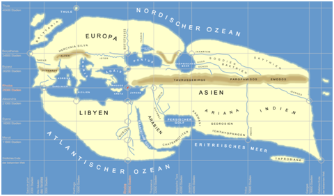

# Ератосфен

&laquo;Батьком географії&raquo; заслужено називають Ератосфена. Він першим назвав науку про Землю &laquo;географією&raquo;, обчислив коло Землі, визначив її розміри, виділив п &rsquo;ять зон &ndash; жарку, дві помірні й дві холодні &ndash; та описав їхні межі. Ератосфен склав карту світу, розширивши його межі від Греції до островів Цейлон та Ісландія.

	

<i> Рисунок 2.1.3. Світ за Ератосфеном </i>

На карті світу Птолемей застосував градусну сітку. Птолемеївська геоцентрична система світу, а також математична теорія руху планет навколо нерухомої Землі, була актуальною до 1543 року, коли польський астроном Микола Коперник запропонував альтернативну, геліоцентричну систему. Тобто ця теорія панувала 1500 років.

<iframe align="center" width="560" height="315" src="https://www.youtube.com/embed/1THnJoJyPDw" frameborder="0" gesture="media" allow="encrypted-media" allowfullscreen></iframe>

