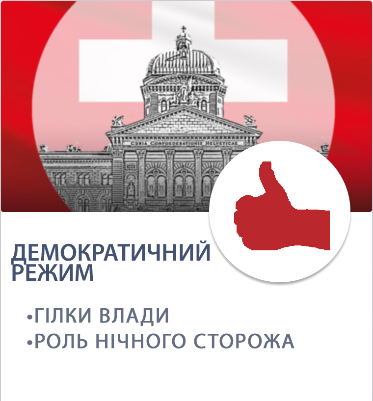

# Демократичний політичний режим

Демократія є найскладнішим типом політичного режиму. Термін «демократія» в перекладі
з грецького (demos – народ, kratos - влада, владарювання) означає «владу народу».
У країнах із демократичним політичним режимом носієм влади вважається народ. Це
означає, що населення держави може впливати на її політичні процеси. 
 

<i></i>

 
Характерними ознаками демократичного режиму є наступні:
<li> визнання влади народу;</li>
<li> основні органи держави є виборними;</li>
<li>право голосу має кожен громадянин держави;</li>
<li>усі громадяни мають рівні права; держава слідкує за їх дотриманням, захищає порушені
права;</li>
<li>глава держави та органи влади звітують перед своїми виборцями;</li>
<li>влада не може діяти у своїх інтересах, адже представляє інтереси народу;</li>
<li>розподіл влади на три гілки: законодавчу, виконавчу та судову.</li>

Одними із основних принципів демократичних держав є принципи виборності влади та
багатопартійності. Кожна партія має власну програму дій, яку представляє перед
виборами та якої повинна дотримуватись.     
При демократичному режимі держава відіграє роль «нічного сторожа». Це означає, що
держава не вправі контролювати та обмежувати простір своїх громадян. Її роль зводиться
до мінімальних функцій, які необхідні для забезпечення охорони порядку і захисту
держави від агресії інших країн.   
 

 
Залежно від того, як народ здійснює своє право на владу, можна виділити три основні
способи реалізації демократії:
       
1) кожна особа має право голосу. Весь народ ухвалює рішення і стежить за їх виконанням.
Така форма демократії була характерною для ранніх держав (наприклад, для Стародавньої
Греції) або родових общин.      
2) народ приймає рішення лише в певних випадках, наприклад, під час референдуму.        
3) народ обирає своїх представників, і вони від його імені та в його інтересах приймають
рішення та управляють державою. Така форма демократії називається представницькою.
Вона є найпоширенішою формою народовладдя.   
 
Якщо недоліки тоталітарного та авторитарного режиму видаються очевидними, то
недоліки демократичного режиму менш помітні, проте, безумовно, мають місце в житті.
Демократію недарма визначають режимом «панування більшої частини суспільства над
кращою». Верхівку влади можуть представляти не кращі представники інтелігенції та
професіонали, а крадії та дилетанти, які хитрощами та маніпуляціями отримали владу.
Окрім цього, такі особи визначають владу самоціллю і використовують своє становище
для задоволення особистих інтересів.        
Звичайно, ці політичні режими є лише традиційними моделями. У чистому вигляді вони
зустрічаються дуже рідко, тому що у кожній державі формуються під впливом багатьох
внутрішніх та зовнішних факторів. Ще частіше у державах встановлюються змішані
політичні режими.       
Зокрема, політична система України досі є перехідною та має ознаки як демократичного,
так і авторитарного політичних режимів. При цьому у ст. 1 Конституції України
закріплено наступне: <i>"Україна є суверенна і незалежна, демократична, соціальна, правова
держава". </i>      
Так, в Україні кожен громадянин має право голосу, а тому може обрати Президента,
членів Верховної Ради або членів місцевих органів влади. Для України характерними є
багатопартійність та визнання основних прав та свобод людини. Проте зрештою, ці права
не завжди реалізовуються на практиці, а тому Україна лише на шляху перетворення своєї
політичної системи в класичну демократичну.         
