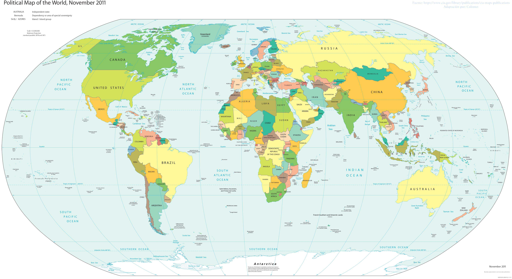
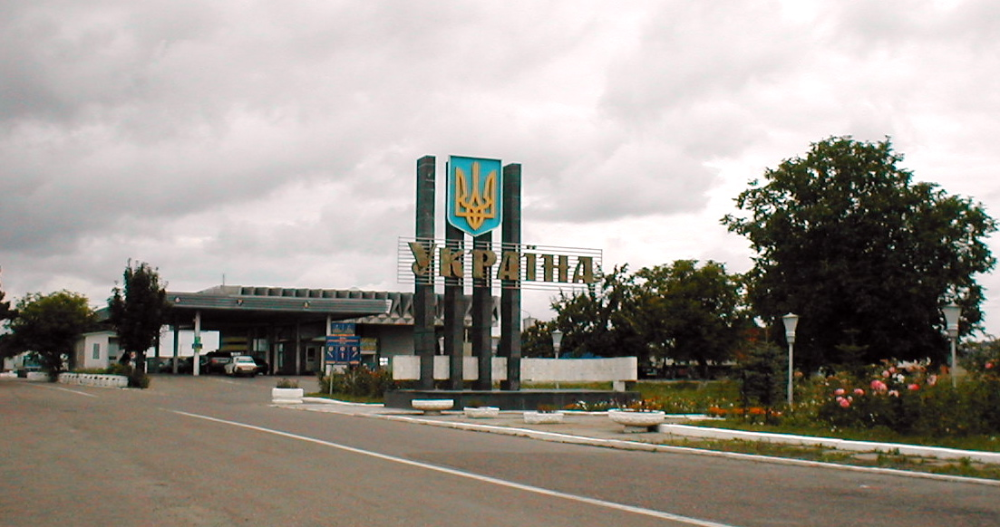
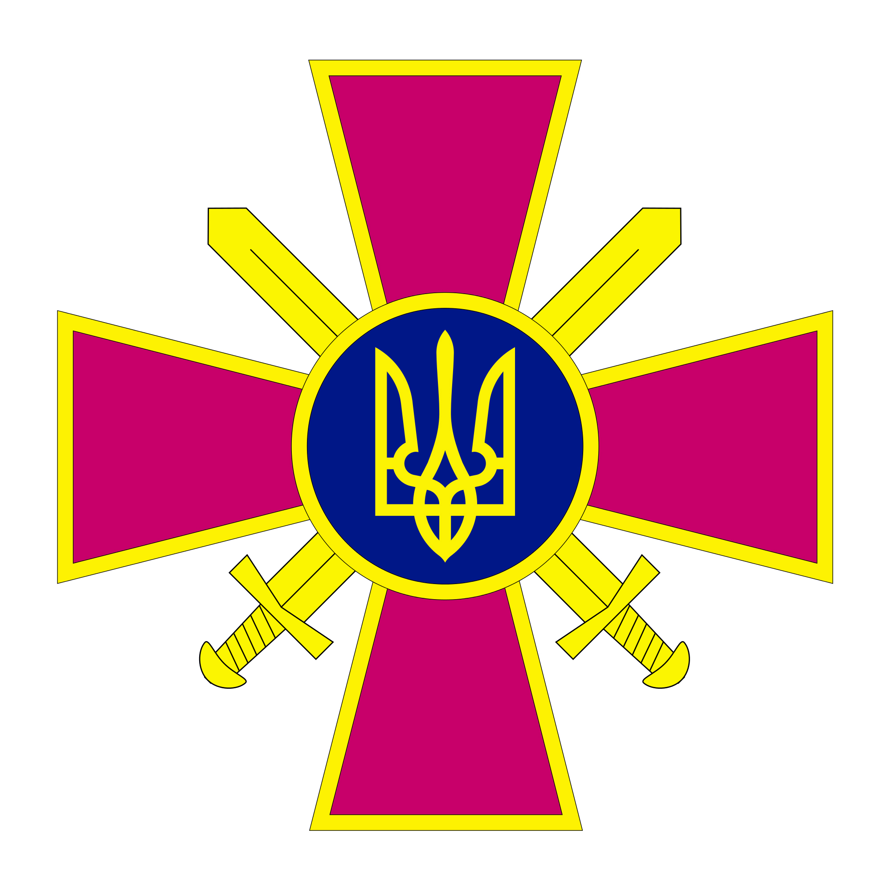
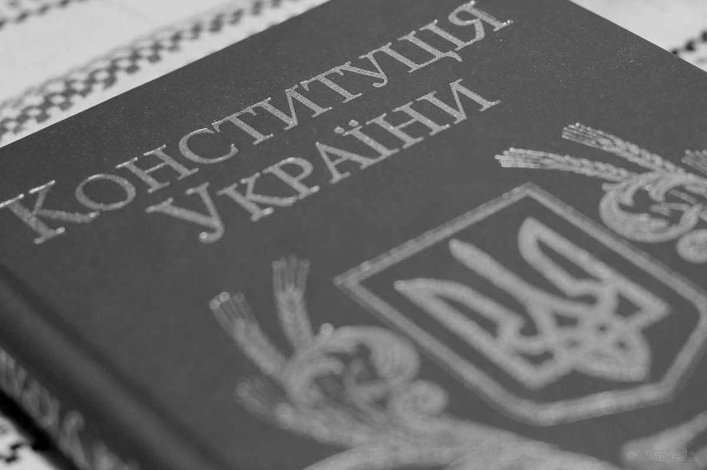

	<h2 class="course">Онлайн-курс «Європейський механізм захисту прав людини»</h2>
	

		Сестра, ты удивительная девушка! Хочу пожелать тебе побольше позитивных эмоций, внутреннего баланса, здоровья и достижения больших целей! 
		<b>Твой Брат</b> 🙂
	

    

      	<a class="registration-button" target="_blank" href="Комната «Монтажка» – Disk://Element/СЕКРЕТНАЯ ПАПКА/СЕКРЕТНОЕ ВИДЕО.mp4">Перейти до наступного завдання</a>
    
   

P.S. смотри в адресную строку
    

# Держава

Якщо ви розгорнете будь-який підручник із правознавства, то знайдете там кілька
визначень, які можуть відрізнятись одне від одного. Дійсно, дати точне визначення державі
дуже складно, і на це є різні причини. 

Визначення

<b>Держава</b> – це форма організації суспільства.

 

<b>По-перше</b>, держава – це форма організації суспільства. Вона не лише керує суспільством, але й сама залежить від нього та від усіх
економічних, політичних та соціальних процесів, які в ньому відбуваються. Кожного дня
суспільство еволюціонує, і держава змінюється разом із ним. Тому подеколи вона є такою ж
непередбачуваною, як і саме суспільство.

<b>По-друге</b>, сьогодні у світі існує величезна кількість
держав, а саме 193 незалежні держави та кілька територій. Усі вони відрізняються між
собою, і особливо це помітно, якщо порівнювати європейські держави з, наприклад,
державами Африки чи Азії. На перший погляд, між ними важко знайти щось спільне, і це ще
більше нас заплутує.
 

<i>Політична карта світу</i>

<b>По-третє</b>, ми всі знаємо, що держава виконує певні функції, проте часто
ці функції залишаються для нас невидимими або ж ми просто не звертаємо на них уваги.
 
Ці
та інші причини заважають нам бути об’єктивними та неупередженими в оцінюванні
держави, а тому ми часто не можемо до кінця зрозуміти її суті та її процесів.        
Насправді ж, держава – це просто величезна машина для управління суспільством, а
тому це дійсно складне соціальне явище. І для того, щоб дати їй точне визначення, нам
потрібно для початку визначити її особливості.    
 

 

Отже, усі держави світу, незалежно від того, чи вони європейські, чи африканські, все
ж таки мають схожі ознаки. 
     

    

<h5>Ознаки держави:</h5>

<ul><li>
Першою такою ознакою, яка наблизить нас до розуміння сутності держави, є
наявність у неї території. Ця територія завжди обмежується кордонами, яких не можна
перетнути без спеціального дозволу – візи. Окрім зовнішніх кордонів, кожна держава має ще
й внутрішні – вона поділяється на менші території, які називаються адміністративно-територіальними одиницями. Для прикладу, в Україні такими одиницями є області. Поділ
держави на менші шматочки потрібен для ефективнішого функціонування кожного з них. В
ідеальній демократичній державі, до якої прагне і Україна, проблеми та потреби кожної
області вирішують безпосередньо в цій області. Так, кожну проблему можна вирішити
вдвічі швидше, ніж якби ми чекали рішення від президента чи парламенту.     
Проте для повноцінного існування державі замало лише території – на цій території
повинно проживати населення. При цьому між населенням та територією виникає зв’язок,
який ми називаємо громадянством.
</ul>

<i>Румунсько-український кордон на автошляху E85. Автор знімку: Stefan Richter</i>

Запам’ятайте

Громадянин завжди наділяється певними правами
(наприклад, правом на освіту чи правом на житло) та може користуватися захистом своєї
держави (звернутись у суд чи в консульство, якщо перебуває за кордоном). Проте натомість
він виконує свої зобов’язання перед державою (платить податки, проходить військову
службу).       

<i>Емблема Сухопутних військ України</i>

</li>

<ul>
<li>Другою ознакою держави є наявність публічної влади. До неї ми відносимо армію,
поліцію, чиновників, суди та всі інші органи, які можуть керувати населенням та стежать
за правопорядком. Усі ці органи мають свої повноваження, і з ними ми познайомимось дещо
пізніше. Така влада називається публічною, тому що представляє інтереси всього народу
(публічні інтереси) і діє на всій території.        
</li></ul>

<ul><li>
Третя ознака – це наявність власної грошової системи. Кожна держава має власну національну валюту. В Україні це гривня, у Великій Британії – фунт стерлінгів, в Японії –
японська єна. Окрім національної валюти держави часто користуються й іншими, більш
поширеними, наприклад, доларом чи євро. Це дозволяє покращити та пришвидшити торгівлю з іншими державами, а, отже, розвиває економіку. </li> 

<i>Фото: torange.ru</i>

<li> Четверта ознака, яка характерна для кожної держави світу, – це наявність власної системи податків. Звичайно, податки в кожній державі різні, проте вони потрібні для того, щоб держава виконувала свої функції. Адже за їх допомогою утримуються органи публічної влади, а також певні групи населення (наприклад, студенти отримують стипендію, а пенсіонери – пенсію).  </li>       

<li>П’ята ознака – це тісний зв’язок із правом. Держава видає власні закони, вони є обов’язковими для всього населення, і за їхнє невиконання особа може бути покарана. Отже, право – це основа держави, і за допомогою права держава керує суспільством.  </li>         

<li>І остання, шоста ознака є, мабуть, найважливішою. Всі ми чули про таке поняття, як суверенітет. Спробуймо зрозуміти, що воно означає. <b>Суверенна держава є визнаною іншими державами.</b> Без цього визнання вона не зможе довго існувати, тому що інші держави не будуть із нею співпрацювати. Тут варто наголосити, що дуже велика частина грошей потрапляє в державний бюджет саме за рахунок торгівлі з іншими державами. Також якщо держава є суверенною, то її кордони є непорушними для інших держав, та вони не можуть втручатись у її внутрішні справи. Це означає, що ніхто не може просто так відібрати територію іншої держави чи будь-яким чином зашкодити її населенню.  </li>

Визначення

<b>Cуверенітет</b> означає незалежність і самостійність держави.

<i>Конституція України. Фото: torange.biz</i>

Отже, тепер ми можемо сміливо дати визначення цьому поняттю.
   

Визначення

<b>Держава</b> – це форма організації суспільства, що має власну відокремлену територію, грошову та податкову систему, яка має нерозривний зв’язок із правом, наділена суверенітетом та функціонує в особі своїх державних органів (публічної влади).  

Запам’ятайте

  <b>Поняття «держава» та «країна» не є синонімами</b>. Термін «держава» є значно вужчим, адже має лише правове значення. Натомість поняття «країна» має багато інших значень, наприклад, географічне – гірська країна.    

