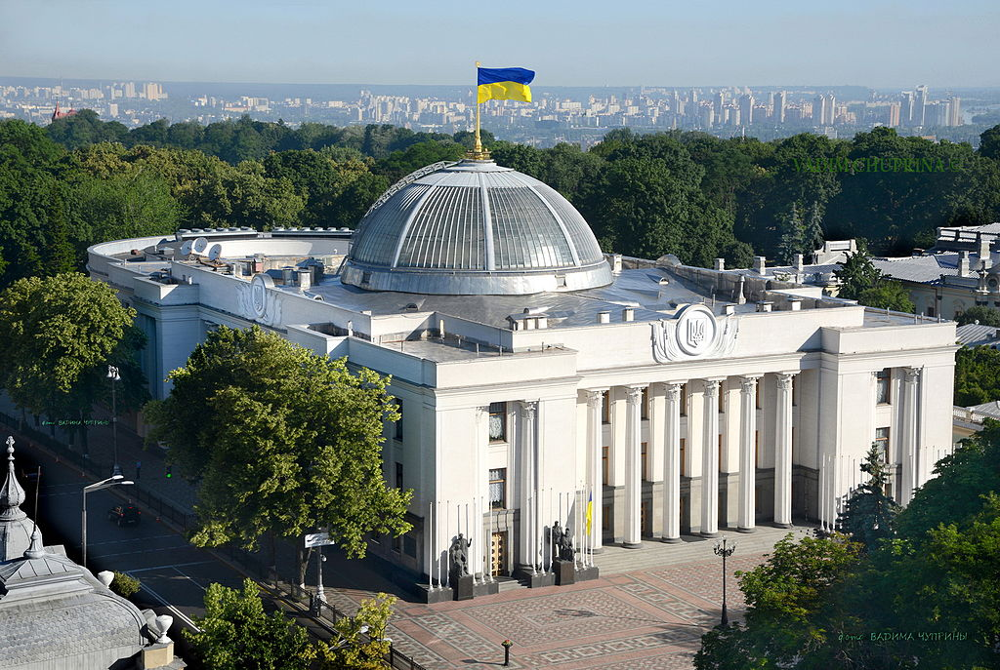
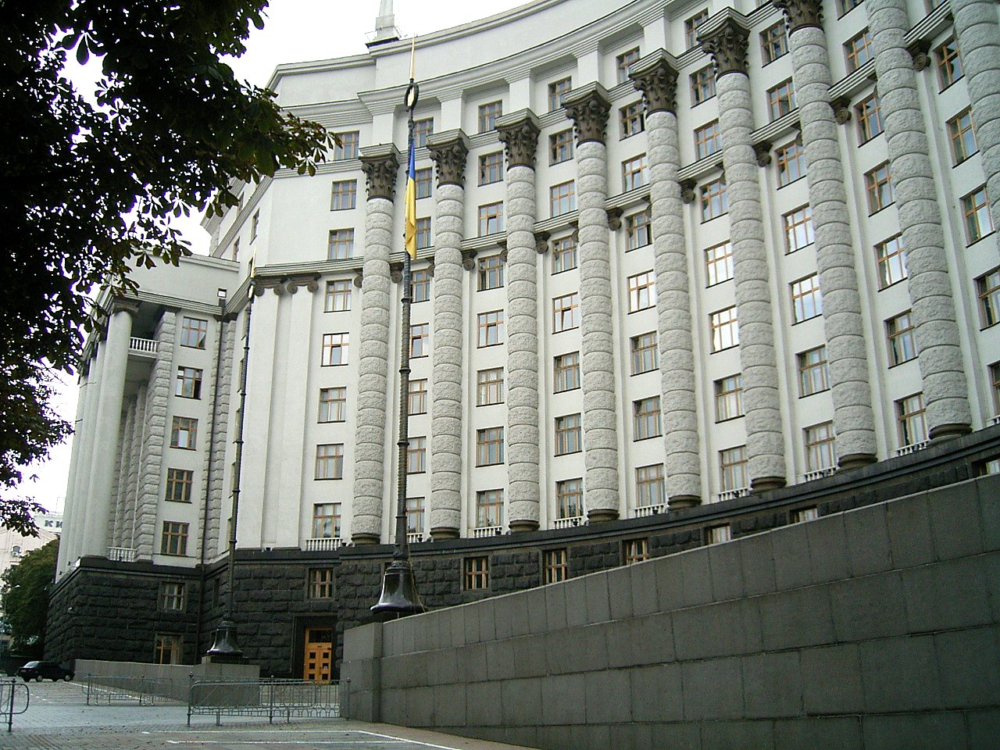
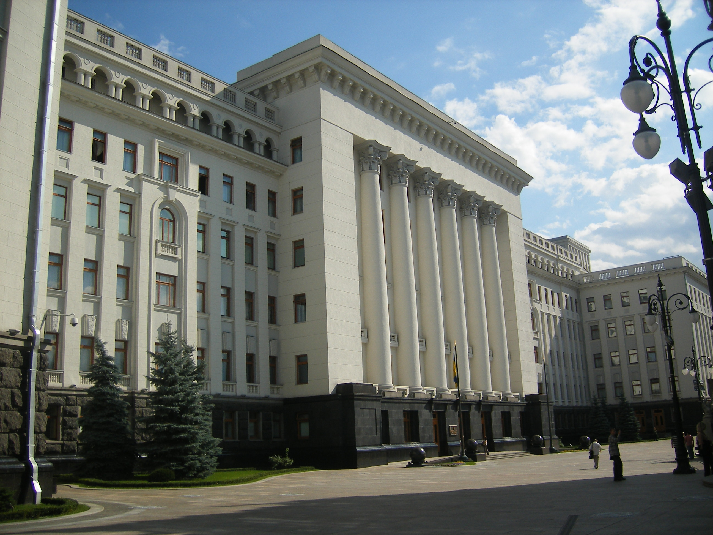

# Завдання держави

       
Як і держава, її органи мають свої особливості, що притаманні для них усіх. Перш за все варто наголосити, що всі органи держави представляють інтереси народу або ж діють в його інтересах. Вони мають певну структуру та свої власні повноваження, вони взаємодіють з іншими органами та мають кілька інших важливих ознак.  

    

Найголовнішим принципом діяльності державних органів є принцип розподілу влади. Цей принцип є фундаментальним для всіх демократичних держав, зокрема і для України. У чому він полягає?        
  Відповідно до цього принципу всі органи влади поділяються на 3 гілки: <b>законодавчу</b>, <b>виконавчу</b> та <b>судову</b>. Ці гілки влади є цілком відокремленими, тобто вони діють незалежно одна від одної. 
    
 

Запам’ятайте

     Будь-який тиск з боку інших гілок влади заборонений та карається законом.     

 
      

 
    Для прикладу, законодавчим органом в Україні є Верховна Рада України. Вона складається з 450 народних депутатів, яких обирає народ та які представляють його інтереси. Чому Верховна Рада України називається законодавчим органом? Все просто: це єдиний орган, який може видавати закони. Звичайно, Кабінет Міністрів України, Президент України чи Генеральна прокуратура теж можуть видавати свої акти, але закон завжди матиме вищу силу і буде пріоритетнішим. Це означає, що якщо між законом Верховної Ради України та, наприклад, указом Президента України є невідповідність, то ми будемо використовувати закон.

 

<i>Верховна Рада України. Автор знімку: ВАДИМ ЧУПРИНА</i>

 
Виконавчим органом влади є Кабінет Міністрів, а також усі інші міністерства, відомства та місцева влада, тобто обласні, міські, сільські ради. Їхнє основне завдання – втілювати закони та стежити за їх дотриманням.          

<i>Кабінет Міністрів. Автор знімку:  Alexander Noskin</i>

 
Судова гілка влади представлена всіма судами. Призначення судів – здійснювати правосуддя.  

    

Запам’ятайте

    Рішення суду завжди є обов’язковим, і особа, щодо якої прийняте це рішення, не може його не виконати.   
     

 
 
 
     

Принцип розподілу влади особливо важливий саме для судів. Держава повинна дбати про те, щоб суди були незалежними від інших органів і щоб на суддів не здійснювався тиск. Кожен суддя має бути неупередженим, справедливим і керуватися лише законом, адже він вирішує долі людей. У суді громадяни України можуть захистити свої права. А це, як ми з вами вже знаємо, найважливіше завдання держави сьогодні. 
  

      

<i>Верховний Суд України. Автор знімку: Wadco2</i>

    

 
Окрім традиційних трьох гілок влади, сьогодні часто говорять про четверту гілку – <b>контрольно-наглядову</b>. До неї входять, наприклад, <i>Генеральна прокуратура України</i> чи <i>СБУ</i>. Їхнє призначення – стежити за порядком, виявляти злочини, знаходити винних та карати їх.          

    
    

 

<i>Адміністрація Президента України. Автор знімку: Avaness</i>

Цікаво

    
<b>Президент України не належить до жодної гілки влади</b>. Його основне завдання – гарантувати дотримання прав та свобод кожного громадянина, а також представляти нашу державу у відносинах з іншими державами чи міжнародними організаціями. Для порівняння, у США Президент є представником виконавчої влади.

